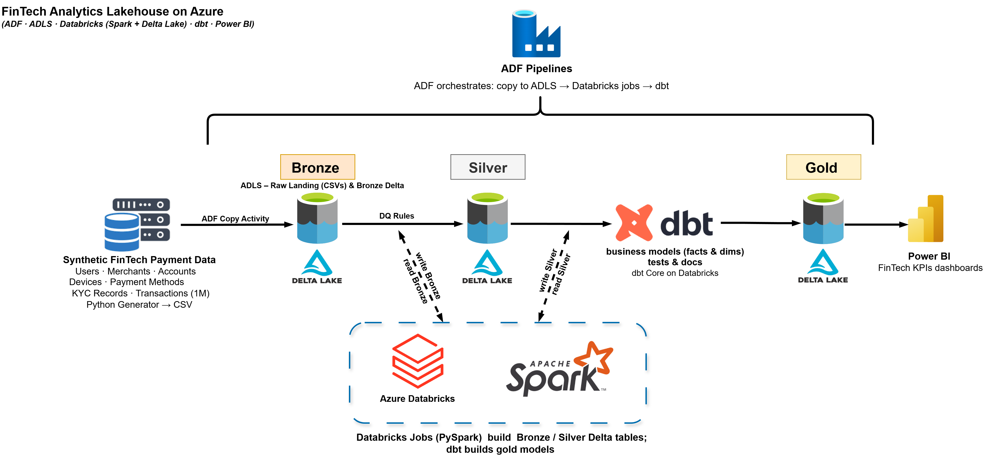
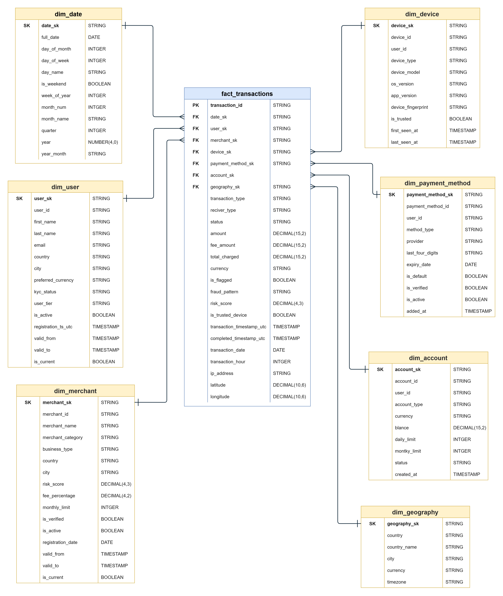

# FinTech Analytics Lakehouse on Azure

[](https://www.python.org/)
[](https://azure.microsoft.com/en-us/services/data-factory/)
[](https://azure.microsoft.com/en-us/services/storage/data-lake-storage/)
[](https://databricks.com/)
[](https://www.getdbt.com/)
[](https://powerbi.microsoft.com/)

> **An end-to-end, production-grade Medallion Lakehouse design for 1M+ FinTech payment transactions targeting the UAE/KSA/Egypt market.**

This portfolio project demonstrates a full data engineering architecture for FinTech digital payments in MENA: realistic source generation, Bronze/Silver quality pipeline design, and Gold dimensional modeling for analytics.

---

## Architecture



## Gold Star Schema



Detailed version: [Gold Star Schema - Detailed](docs/diagrams/gold-star-schema-detailed.png)

---

## Why This Project

A fast-growing digital payment platform in MENA faces three core challenges:

| Challenge | Pain Point | Solution |
|---|---|---|
| Data silos | KYC, devices, and transactions are disconnected across MENA operations | Unified Lakehouse with Bronze/Silver/Gold layers |
| Slow fraud analysis | Cross-border and device-based fraud investigations are slow | Fraud-ready curated layers and risk-focused facts |
| Reconciliation delays | Multi-currency reporting across timezone boundaries is error-prone | Currency-safe Gold facts and controlled KPI definitions |

---

## Data Generator (Custom Source)

The project includes a custom Python generator (`data-generator/`) with:

- 7 linked entities: `users`, `accounts`, `merchants`, `transactions`, `devices`, `payment_methods`, `kyc_records`
- realistic MENA demographics and regional providers (`mada`, `meeza`, `knet`)
- 5 fraud patterns: `velocity`, `amount`, `time`, `new_device`, `cross_border`
- intentional DQ anomalies for Silver engineering work:
  - duplicate transaction IDs
  - negative amounts
  - invalid timestamp order
  - controlled nullable fields

---

## Quick Data Preview

Sample dataset is included in:

- [`data-generator/output_sample/`](data-generator/output_sample/)

Current sample size (generated with `--small`):

| Entity | Records |
|---|---:|
| `users` | 1,000 |
| `merchants` | 100 |
| `accounts` | 1,272 |
| `devices` | 1,692 |
| `payment_methods` | 1,732 |
| `kyc_records` | 1,000 |
| `transactions` | 10,100 |

Full baseline target (generation mode `--full`): 50K users, 2K merchants, 1M transactions (+ intentional duplicates).

### Inline Evidence (from `output_sample`)

- MENA names and countries visible in sample rows:
  - `Farhan Qureshi (SA)`, `Farah Chaudhry (AE)`, `Maha Elshamy (SA)`, `Mishal Naguib (EG)`
- Regional and global providers are present:
  - `mada`, `meeza`, `knet`, `visa`, `mastercard`, `amex`
- Fraud labels are visible in transactions:
  - flagged rows with patterns such as `velocity`

---

## Target Data Flow (Design)

1. **Source:** Python generator outputs raw CSV data.
2. **Bronze:** ADF orchestrates ingestion to ADLS Gen2.
3. **Silver:** Databricks PySpark performs UTC normalization, deduplication, and DQ quarantine routing.
4. **Gold:** dbt builds 4 facts and 7 dimensions (including SCD2 and as-of joins).
5. **BI:** Power BI consumes Gold tables for Risk, Finance, and Product KPIs.

---

## Documentation

Core design docs:

1. [Business Requirements (BRD)](docs/01-business-requirements.md)
2. [Project Overview](docs/02-project-overview.md)
3. [Data Dictionary](docs/03-data-dictionary.md)
4. [Source-to-Target Mapping](docs/04-source-to-target-mapping.md)
5. [Data Quality Framework](docs/05-data-quality.md)
6. [Gold Data Model](docs/06-data-model.md)

Full index: [Documentation Index](docs/00_index.md)

---

## Quick Start (Generator)

From repository root:

```powershell
python -m venv .venv
.\.venv\Scripts\Activate.ps1
pip install -r data-generator/requirements.txt

# fast local validation (writes commit-friendly sample)
python data-generator/main.py --small --format csv --output data-generator/output_sample

# full baseline generation
python data-generator/main.py --full --format csv --output data-generator/raw_data
```

---

## Project Status

| Phase | Status | Details |
|---|---|---|
| Design docs (BRD, model, dictionary, DQ, STM) | Complete | 6 documents, fully cross-referenced |
| Data generator | Complete | 7 entities, 1M+ rows, MENA demographics, 5 fraud patterns |
| Azure infrastructure setup | Planned | ADLS Gen2, Databricks workspace, ADF |
| Bronze/Silver/Gold implementation | Planned | PySpark cleansing, dbt modeling, DQ quarantine |
| BI dashboards | Planned | Power BI Risk and Finance KPI dashboards |

### Implementation-Phase Metrics (to add after build)

- Silver quarantine rate by entity
- Bronze to Silver row reconciliation
- dbt test pass rate and freshness checks
- Gold KPI validation snapshots (TPV, success rate, fraud rate)

---

Created by [Mohamed Abdellatef](https://github.com/MohamedAbdellatef) for portfolio demonstration.
